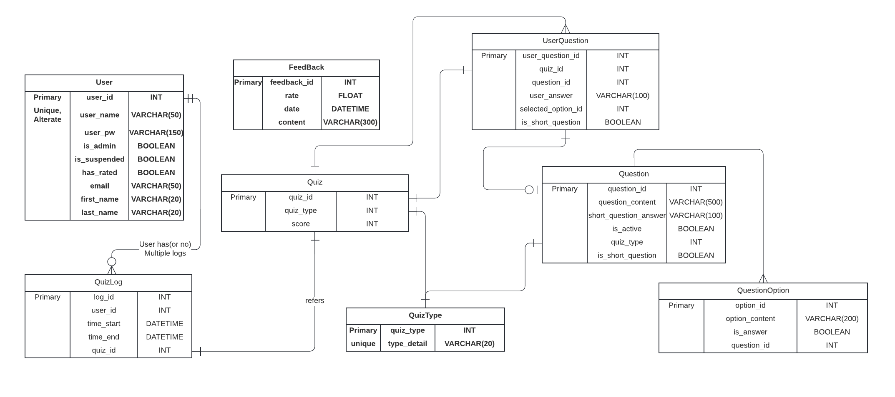

# hibernate_quiz_webapp
Web application app using hibernate framework with criteria functions with MySQL.

# Application requirements

- MySQL Database - [download](https://dev.mysql.com/downloads/file/?id=526927)
- Java 8
- JavaSpring boot
- Maven 


## How to setup application

Make sure your mySQL is running before running.
Set environment variables accordingly like below to connect with your DB.
```
DB_NAME={YOUR DB NAME};
DB_PASS={YOUR PASSWORD};
DB_URL={YOUR_DB_URL}:{YOUR_DB_PORT};
DB_USER={YOUR_DB_USER};
APP_PORT={YOUR_APPLICATION_PART}
```
Or edit `src/main/resources/application.properties` directly.
```application.properties
database.driver=com.mysql.cj.jdbc.Driver
database.url=${DB_URL}/${DB_NAME}
database.username=${DB_USER}
database.password=${DB_PASS}
database.hibernate.dialect=org.hibernate.dialect.MySQL8Dialect
database.hibernate.showsql=true
database.hibernate.hbm2ddl.auto=update
spring.mvc.view.prefix=/WEB-INF/jsp/
spring.mvc.view.suffix=.jsp
server.port=${APP_PORT}
```

if your db requires to be initialized with tables and columns, change following line in `src/main/resources/application.properties`.

```
database.hibernate.hbm2ddl.auto=create
```

After running the application, you must set this value to `update` to avoid data wipe.

```
database.hibernate.hbm2ddl.auto=update
```

Run application with following command

`nohup java -Dserver.port=$APP_PORT -jar QuizApp.war &`

## Postman collection
Postman collection set can be found at `script/QuizAppCollection.postman_collection.json`

## Database Schema



## Application website
<div align="center">
  
  
  
  
  
  
  
  
  
</div>

